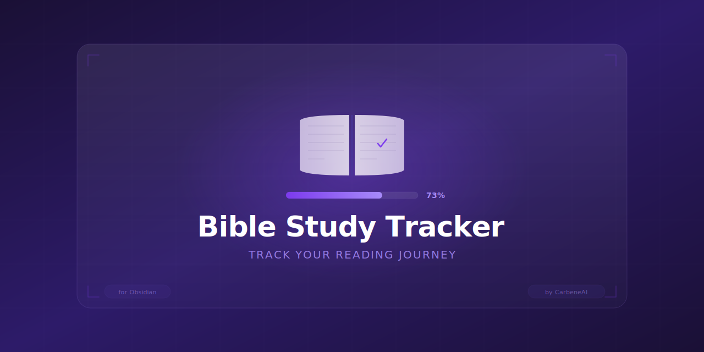

<p align="center">
  
</p>

# Bible Reading Tracker

A simple, effective Bible reading tracker for Obsidian with automatic progress visualization.

[](https://obsidian.md)
[](https://opensource.org/licenses/MIT)

> Track your Bible reading journey with automatic progress bars, chapter checklists, and a unified dashboard.

## Features

- **Visual Progress Tracking** - See your progress with progress bars for overall, testament, and per-book completion
- **Single Source of Truth** - Mark chapters as read in book files, dashboard updates automatically
- **All 66 Books** - Complete coverage of Old and New Testament organized by genre
- **Dataview Powered** - Dynamic queries that update in real-time as you read
- **Clean Organization** - Books organized by testament and genre (Law, History, Poetry, Prophets, Gospels, Epistles)

## Quick Start

1. **Install Obsidian** - Download from [obsidian.md](https://obsidian.md)
2. **Clone/Download** this repository into your Obsidian vault
3. **Enable Dataview Plugin**:
   - Settings → Community Plugins → Browse
   - Search "Dataview" → Install → Enable
   - In Dataview settings, enable "Enable JavaScript Queries"
4. **Open `statistics-dashboard.md`** - Your main tracking hub

## How to Track Reading

1. Open any book file (e.g., `Old Testament/Law/Genesis.md`)
2. Find the chapter you read
3. Check the box: `- [ ] Read` → `- [x] Read`
4. Add the date: `- [x] Read 2025-01-05`
5. Dashboard updates automatically!

### Example Chapter Entry
```markdown
### Chapter 1
- [x] Read 2025-01-05
Notes:
- Creation account
- God's orderly creation process

Key Verses:
- Genesis 1:1 - "In the beginning God created..."
```

## Directory Structure

```
BibleStudyTracker/
├── statistics-dashboard.md    # Main progress dashboard
├── Old Testament/
│   ├── Law/                   # Genesis - Deuteronomy
│   ├── History/               # Joshua - Esther
│   ├── Poetry and Wisdom/     # Job - Song of Solomon
│   ├── Major Prophets/        # Isaiah - Daniel
│   └── Minor Prophets/        # Hosea - Malachi
└── New Testament/
    ├── Gospels/               # Matthew - John
    ├── History/               # Acts
    ├── Pauline Epistles/      # Romans - Philemon
    ├── General Epistles/      # Hebrews - Jude
    └── Prophecy/              # Revelation
```

## Dashboard Features

The `statistics-dashboard.md` provides:

- **Overall Progress** - X of 1,189 chapters completed with visual bar
- **Testament Progress** - Old Testament (929 chapters) vs New Testament (260 chapters)
- **Book-by-Book Tables** - Each section shows individual book progress
- **Recent Activity** - Last 10 chapters you've read

## Book File Structure

Each book file includes:

```yaml
---
book: Genesis
testament: "Old Testament"
section: Law
chapters: 50
tags: [book]
---
```

Plus:
- Overview section (author, themes)
- Per-book progress query
- Chapter-by-chapter checkboxes with space for notes

## Customization

### Adjusting Paths

If you place this in a subfolder of your vault, update the paths in `statistics-dashboard.md`:

```javascript
// Change this:
dv.pages('"BibleStudyTracker/Old Testament"')

// To match your folder:
dv.pages('"YourFolder/Old Testament"')
```

### Adding Notes

Each chapter has space for:
- Personal notes and reflections
- Key verses
- Summary observations

## Requirements

- [Obsidian](https://obsidian.md) (free)
- [Dataview Plugin](https://github.com/blacksmithgu/obsidian-dataview) (free community plugin)
  - Must enable "Enable JavaScript Queries" in Dataview settings

## Troubleshooting

**Dashboard shows 0 progress:**
- Ensure Dataview plugin is installed and enabled
- Enable "JavaScript Queries" in Dataview settings
- Check that folder paths match your vault structure

**Queries not updating:**
- Close and reopen the dashboard file
- Try Cmd/Ctrl+R to reload Obsidian

**Books not appearing:**
- Verify frontmatter has `chapters:` field with a number
- Check file is in correct testament/genre folder

## Contributing

1. Fork the repository
2. Create your feature branch (`git checkout -b feature/NewFeature`)
3. Commit your changes (`git commit -m 'Add NewFeature'`)
4. Push to the branch (`git push origin feature/NewFeature`)
5. Open a Pull Request

## License

This project is open source under the MIT License. See [LICENSE](LICENSE) for details.

---

*"Your word is a lamp for my feet, a light on my path." - Psalm 119:105*
